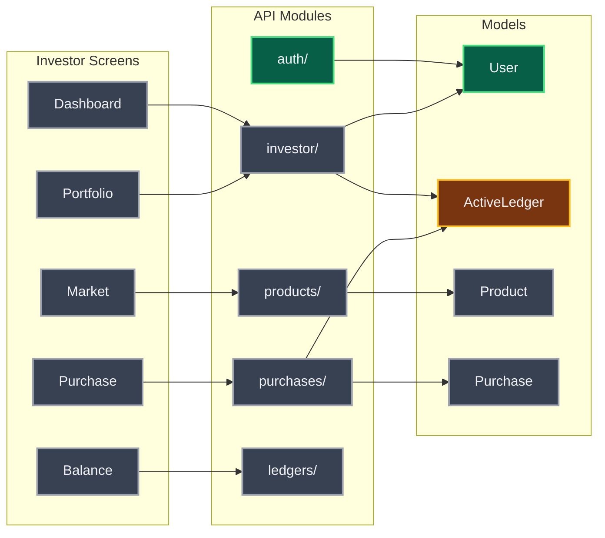
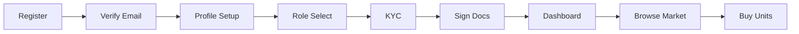

# HTML Template Reference

Single-file interactive visualization at `mockups/project-map/index.html`.

---

## Page Structure

```html
<!DOCTYPE html>
<html lang="ru">
<head>
  <meta charset="UTF-8">
  <meta name="viewport" content="width=device-width, initial-scale=1.0">
  <title>CBS HOME Project Map</title>
  <link href="https://fonts.googleapis.com/css2?family=Montserrat:wght@400;600;700;800&family=JetBrains+Mono:wght@400;600&display=swap" rel="stylesheet">
  <script src="https://cdn.jsdelivr.net/npm/mermaid@11/dist/mermaid.min.js"></script>
  <style>/* inline CSS */</style>
</head>
<body>
  <!-- HEADER BAR -->
  <header class="pm-header">
    <div class="pm-logo">CBS HOME Project Map</div>
    <div class="pm-stats">
      <span class="pm-stat"><span class="pm-stat-num" id="statScreens">35</span> screens</span>
      <span class="pm-stat"><span class="pm-stat-num" id="statEndpoints">8</span>/<span>103</span> endpoints</span>
      <span class="pm-stat"><span class="pm-stat-num" id="statCoverage">8</span>% coverage</span>
    </div>
    <div class="pm-meta">
      <span id="scanTime">2026-04-04 15:30</span>
      <span id="gitCommit">abc1234</span>
    </div>
  </header>

  <!-- FILTER BAR -->
  <div class="pm-filters">
    <div class="pm-filter-group">
      <label>Role:</label>
      <button class="pm-filter-btn active" data-role="all">All</button>
      <button class="pm-filter-btn" data-role="auth">Auth</button>
      <button class="pm-filter-btn" data-role="investor">Investor</button>
      <button class="pm-filter-btn" data-role="agent">Agent</button>
      <button class="pm-filter-btn" data-role="company">Company</button>
      <button class="pm-filter-btn" data-role="staff">Staff</button>
    </div>
    <div class="pm-filter-group">
      <label>Status:</label>
      <button class="pm-filter-btn st-impl active" data-status="implemented">Implemented</button>
      <button class="pm-filter-btn st-wip active" data-status="in_progress">In Progress</button>
      <button class="pm-filter-btn st-plan active" data-status="planned">Planned</button>
      <button class="pm-filter-btn st-gap active" data-status="gap">Gap</button>
    </div>
    <input type="text" class="pm-search" placeholder="Search screens, endpoints..." id="searchInput">
  </div>

  <!-- TAB BAR -->
  <div class="pm-tabs">
    <button class="pm-tab active" data-tab="l0">L0 Overview</button>
    <button class="pm-tab" data-tab="l1">L1 Screens-API</button>
    <button class="pm-tab" data-tab="l2">L2 Fields-Models</button>
    <button class="pm-tab" data-tab="deadends">Dead-Ends</button>
    <button class="pm-tab" data-tab="readiness">Prod-Readiness</button>
  </div>

  <!-- CONTENT PANELS -->
  <main class="pm-content">
    <div class="pm-panel active" id="panel-l0"><!-- Mermaid diagrams --></div>
    <div class="pm-panel" id="panel-l1"><!-- Screen-endpoint cards --></div>
    <div class="pm-panel" id="panel-l2"><!-- Model field tables --></div>
    <div class="pm-panel" id="panel-deadends"><!-- Orphan lists --></div>
    <div class="pm-panel" id="panel-readiness"><!-- Traffic lights --></div>
  </main>

  <script>/* inline JS */</script>
</body>
</html>
```

---

## CSS Design Tokens

Match mockup hub dark theme (`mockups/index.html`):

```css
:root {
  /* Background */
  --pm-bg: #0A0A0F;
  --pm-bg-card: #12121A;
  --pm-bg-hover: #1A1A25;
  --pm-border: rgba(255,255,255,0.08);

  /* Text */
  --pm-text: #F0F0F5;
  --pm-text-secondary: #8888A0;
  --pm-text-muted: #555570;

  /* CBS Brand */
  --pm-orange: #E8651A;
  --pm-orange-dim: rgba(232,101,26,0.15);
  --pm-teal: #228B8A;
  --pm-teal-dim: rgba(34,139,138,0.15);
  --pm-gold: #EFB44C;

  /* Status Colors */
  --pm-implemented: #4ADE80;
  --pm-implemented-bg: rgba(74,222,128,0.1);
  --pm-in-progress: #FBBF24;
  --pm-in-progress-bg: rgba(251,191,36,0.1);
  --pm-planned: #9CA3AF;
  --pm-planned-bg: rgba(156,163,175,0.1);
  --pm-gap: #F87171;
  --pm-gap-bg: rgba(248,113,113,0.1);

  /* Layout */
  --pm-radius: 12px;
  --pm-radius-sm: 6px;
  --pm-font: 'Montserrat', sans-serif;
  --pm-mono: 'JetBrains Mono', monospace;
}
```

---

## Key CSS Classes

### Header
```css
.pm-header {
  display: flex; align-items: center; justify-content: space-between;
  padding: 16px 24px;
  background: var(--pm-bg-card);
  border-bottom: 1px solid var(--pm-border);
  position: sticky; top: 0; z-index: 100;
}
```

### Filter buttons
```css
.pm-filter-btn {
  padding: 4px 12px; border-radius: var(--pm-radius-sm);
  background: transparent; border: 1px solid var(--pm-border);
  color: var(--pm-text-secondary); cursor: pointer;
  font-size: 12px; font-family: var(--pm-font);
}
.pm-filter-btn.active { background: var(--pm-teal-dim); border-color: var(--pm-teal); color: var(--pm-text); }
```

### Tab bar
```css
.pm-tab {
  padding: 8px 20px; background: none; border: none;
  color: var(--pm-text-secondary); font-weight: 600;
  border-bottom: 2px solid transparent; cursor: pointer;
}
.pm-tab.active { color: var(--pm-orange); border-bottom-color: var(--pm-orange); }
```

### Cards (L1)
```css
.pm-card {
  background: var(--pm-bg-card);
  border: 1px solid var(--pm-border);
  border-radius: var(--pm-radius);
  margin-bottom: 12px; overflow: hidden;
}
.pm-card-header {
  display: flex; justify-content: space-between; align-items: center;
  padding: 14px 18px; cursor: pointer;
}
.pm-card-body { padding: 0 18px 14px; display: none; }
.pm-card.open .pm-card-body { display: block; }
```

### Score badge
```css
.pm-score {
  padding: 3px 10px; border-radius: 20px;
  font-size: 12px; font-weight: 700;
  font-family: var(--pm-mono);
}
.pm-score.green  { background: var(--pm-implemented-bg); color: var(--pm-implemented); }
.pm-score.yellow { background: var(--pm-in-progress-bg); color: var(--pm-in-progress); }
.pm-score.orange { background: var(--pm-gap-bg); color: var(--pm-gold); }
.pm-score.red    { background: var(--pm-gap-bg); color: var(--pm-gap); }
```

### Endpoint row
```css
.pm-endpoint {
  display: flex; align-items: center; gap: 8px;
  padding: 6px 0; font-size: 13px;
  border-bottom: 1px solid var(--pm-border);
}
.pm-method {
  font-family: var(--pm-mono); font-weight: 700; font-size: 11px;
  padding: 2px 6px; border-radius: 3px;
  min-width: 50px; text-align: center;
}
.pm-method.get    { background: var(--pm-teal-dim); color: var(--pm-teal); }
.pm-method.post   { background: var(--pm-orange-dim); color: var(--pm-orange); }
.pm-method.patch  { background: var(--pm-in-progress-bg); color: var(--pm-in-progress); }
.pm-method.put    { background: var(--pm-in-progress-bg); color: var(--pm-gold); }
.pm-method.delete { background: var(--pm-gap-bg); color: var(--pm-gap); }
```

---

## Mermaid Theme Configuration

```javascript
mermaid.initialize({
  startOnLoad: true,
  theme: 'base',
  themeVariables: {
    darkMode: true,
    background: '#0A0A0F',
    primaryColor: '#1A3A3A',
    primaryTextColor: '#F0F0F5',
    primaryBorderColor: '#228B8A',
    secondaryColor: '#1A1A25',
    secondaryTextColor: '#F0F0F5',
    secondaryBorderColor: '#E8651A',
    tertiaryColor: '#12121A',
    lineColor: '#555570',
    fontFamily: 'Montserrat, sans-serif',
    fontSize: '13px',
    nodeBorder: '2px',
    clusterBkg: '#12121A',
    clusterBorder: '#333350'
  }
});
```

---

## Mermaid Diagram Templates

### L0 Overview (per role)


### Business Flow Diagram


---

## JavaScript Architecture

```javascript
const PM = {
  // State
  activeTab: 'l0',
  filters: { role: 'all', statuses: ['implemented','in_progress','planned','gap'] },
  searchQuery: '',

  // Data (populated from manifest during generation)
  data: { /* manifest content embedded as JS object */ },

  // Methods
  init() { this.bindEvents(); this.renderActiveTab(); },

  bindEvents() {
    // Tab clicks -> switchTab()
    // Filter clicks -> toggleFilter() -> re-render
    // Search input -> filterByText() -> re-render
    // Card headers -> toggleCard()
  },

  switchTab(tabId) {
    this.activeTab = tabId;
    document.querySelectorAll('.pm-panel').forEach(p => p.classList.remove('active'));
    document.getElementById('panel-' + tabId).classList.add('active');
    document.querySelectorAll('.pm-tab').forEach(t => t.classList.remove('active'));
    document.querySelector('[data-tab="' + tabId + '"]').classList.add('active');
  },

  toggleFilter(type, value) {
    // Toggle role or status filter, re-show/hide cards
  },

  toggleCard(card) {
    card.classList.toggle('open');
  },

  getScoreClass(score) {
    if (score === 100) return 'green';
    if (score >= 50) return 'yellow';
    if (score > 0) return 'orange';
    return 'red';
  }
};

document.addEventListener('DOMContentLoaded', () => PM.init());
```

---

## L1 Card Template (per screen)

```html
<div class="pm-card" data-role="investor" data-status="planned" data-screen="screen-dashboard">
  <div class="pm-card-header" onclick="PM.toggleCard(this.parentElement)">
    <div>
      <span class="pm-card-role">INVESTOR</span>
      <span class="pm-card-title">screen-dashboard</span>
    </div>
    <span class="pm-score red">0%</span>
  </div>
  <div class="pm-card-body">
    <div class="pm-section-title">Required Endpoints</div>
    <div class="pm-endpoint">
      <span class="pm-status-dot" style="background:var(--pm-planned)"></span>
      <span class="pm-method get">GET</span>
      <span class="pm-path">/api/v1/investor/dashboard</span>
      <span class="pm-sprint">Sprint 2.1</span>
    </div>
    <!-- more endpoints -->
    <div class="pm-section-title">Navigation</div>
    <div class="pm-nav-targets">
      <a class="pm-nav-link" href="#screen-portfolio">screen-portfolio</a>
      <a class="pm-nav-link" href="#screen-market">screen-market</a>
    </div>
    <div class="pm-section-title">Data Entities</div>
    <div class="pm-entities">portfolio, balance, transactions, news</div>
  </div>
</div>
```

---

## L2 Model Table Template

```html
<div class="pm-model-card" data-model="User">
  <div class="pm-model-header">
    <span class="pm-model-name">User</span>
    <span class="pm-model-table">users</span>
    <span class="pm-model-file">backend/app/modules/users/models.py</span>
  </div>
  <table class="pm-model-fields">
    <thead><tr><th>Column</th><th>Type</th><th>Nullable</th><th>Default</th></tr></thead>
    <tbody>
      <tr><td>id</td><td>UUID</td><td>no</td><td>uuid4()</td></tr>
      <tr><td>role</td><td>String(20)</td><td>no</td><td>investor</td></tr>
      <!-- more columns -->
    </tbody>
  </table>
  <div class="pm-model-usage">
    <span>Used by:</span> screen-login, screen-register, screen-settings
  </div>
</div>
```

---

## Dead-Ends Panel Template

```html
<div class="pm-deadends">
  <div class="pm-deadend-section">
    <h3>Frontend Orphans <span class="pm-count">28</span></h3>
    <p class="pm-hint">Screens with 0% API backing -- need backend implementation</p>
    <div class="pm-orphan-list">
      <div class="pm-orphan" data-role="investor">
        <span class="pm-orphan-role">INVESTOR</span>
        <span class="pm-orphan-screen">screen-dashboard</span>
        <span class="pm-orphan-blocked">Blocked by Sprint 2.1</span>
      </div>
      <!-- more orphans -->
    </div>
  </div>
  <div class="pm-deadend-section">
    <h3>Backend Orphans <span class="pm-count">0</span></h3>
    <p class="pm-hint">Endpoints with no frontend consumer</p>
  </div>
</div>
```

---

## Prod-Readiness Panel Template

```html
<div class="pm-readiness">
  <div class="pm-ready-group">
    <h3 style="color:var(--pm-implemented)">Ready for Prod</h3>
    <div class="pm-ready-item">
      <span class="pm-traffic green"></span>
      <span>screen-login</span>
      <span class="pm-score green">100%</span>
    </div>
  </div>
  <div class="pm-ready-group">
    <h3 style="color:var(--pm-in-progress)">Nearest to Ready</h3>
    <!-- items with 50-99% -->
  </div>
  <div class="pm-ready-group">
    <h3 style="color:var(--pm-gap)">Blocked</h3>
    <!-- items with 0-49% -->
  </div>

  <h3 style="margin-top:24px">Business Flows</h3>
  <div class="pm-flow-item">
    <span class="pm-flow-name">Investor: Register -> Buy</span>
    <div class="pm-flow-bar">
      <div class="pm-flow-fill" style="width:25%"></div>
    </div>
    <span class="pm-score orange">25%</span>
  </div>
</div>
```

---

*html-template v1.0.0*
